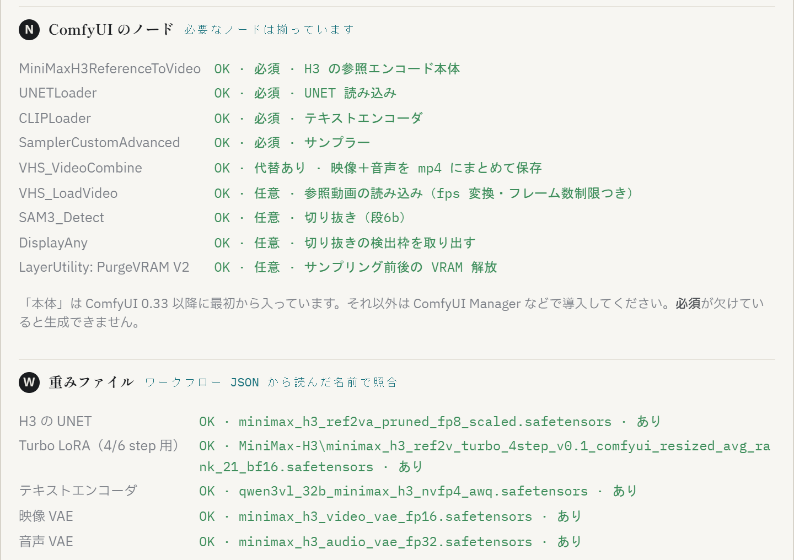

# 01. 準備 — config.json を作って起動し、「設定」画面で確かめる

前提となるソフト（ComfyUI 0.33 以降・Python 3.10 以降・ffmpeg・任意で LM Studio / Eagle）と ComfyUI 側のノードは [README の「必要なもの」](../README.md#必要なもの) を見てください。この章は「それらが入ったあと、アプリが動くまで」の手順です。

## 1. config.json を作る

アプリのフォルダにある `config.example.json` をコピーして `config.json` を作り、自分の環境に合わせて書き換えます。**コードにパスは書かれていません。環境依存はすべてこのファイルです。**

最初に直すのは次の6つだけで動きます（他のキーは既定値のままで可）:

| キー | 何に直すか |
|---|---|
| `comfy_url` | ComfyUI のアドレス。既定 `http://127.0.0.1:8189`。ポートが違うなら合わせる |
| `comfy_input_dir` | ComfyUI の `input` フォルダ。**参照画像はここから読みます** |
| `comfy_output_dir` | ComfyUI の `output` フォルダ。生成された動画はここに出ます |
| `workflow_json` | **ComfyUI で一度 H3 のワークフローを動かして保存した JSON。** アプリはここからモデルのファイル名・サンプラー・出力形式だけを読みます |
| `prompt_txt` / `archive_dir` | プロンプトの書き出し先。好きな場所でよい |
| `raw_dir` | 切り抜き前の元イラストを置くフォルダ（切り抜き機能を使う場合） |

パスの区切りは `/` で書けます（例 `"C:/ComfyUI/input"`）。

LM Studio でなくクラウド LLM（OpenAI 互換 API）を使う場合の `llm.*` の書き方、Eagle 連携の `eagle.*` は [README の「設定」](../README.md#設定) を参照してください。**API キーの値を config.json に書いてはいけません**（環境変数名だけを書きます）。

## 2. 起動する

```bash
python server.py
```

ブラウザで `http://127.0.0.1:8765` を開きます。ポートを変えるときは `python server.py --port 8799`。

- **LM Studio や ComfyUI が起動していなくても画面は開きます。** 足りないものは「設定」画面に赤で出ます
- 画面は `127.0.0.1` 専用です。認証が無いので、LAN や外部に公開しないでください

止めるときは、サーバーを起動したウィンドウで Ctrl+C。ウィンドウを閉じてしまった場合（Windows）:

```powershell
Get-NetTCPConnection -LocalPort 8765 -State Listen | % { Stop-Process -Id $_.OwningProcess -Force }
```

## 3. 「設定」画面で環境を確かめる

画面右上の **「設定」** を押します。上から4ブロックあり、**生成を始める前にここが緑になっているかを一度見てください。**

### 冒頭: config.json の各パス

config.json に書いたパスが実在するかの照合です。赤が出たらそのキーのパスを直し、「再チェック」を押します。

### N — ComfyUI のノード



いまの ComfyUI に必要なノードが入っているかを自動で照合します。

| 表示 | 意味 | やること |
|---|---|---|
| 必須ノードが赤 | `MiniMaxH3ReferenceToVideo` などが無い | ComfyUI を 0.33 以降に更新する。**これが赤のままだと生成できません** |
| `VHS_VideoCombine` が無い | 代替あり | そのまま使えます（本体の `CreateVideo`+`SaveVideo` に自動で切り替わる。`crf`/`pix_fmt` の指定だけ効かなくなる） |
| `VHS_LoadVideo` が無い | 任意 | **参照動画が使えません。** 参照画像だけなら生成できます。使うなら ComfyUI-VideoHelperSuite を導入 |
| `SAM3_Detect` が無い | 任意 | 切り抜き画面が使えません。切り抜き済み画像を `input` に置けば生成はできます |
| `LayerUtility: PurgeVRAM V2` が無い | 任意 | 生成はできますが、**2本目以降が大きく遅くなることがあります**（[07. 困ったとき](07_困ったとき.md#2本目から急に遅い)） |

「本体」と表示されるノードは ComfyUI 0.33 以降に最初から入っています。それ以外は ComfyUI Manager などで導入してください。

### W — 重みファイル

`workflow_json` から読んだモデルのファイル名が、その ComfyUI に実在するかの照合です。**重みのファイル名は環境ごとに違う**ので、ここが赤のときは:

1. ComfyUI で H3 のワークフローを開き、自分の環境のモデルを選んで保存し直す
2. または config.json の `workflow_json` を、その環境で保存した JSON に向ける

### E — Eagle に送る

任意です。使う場合は [06. 生成と結果](06_生成と結果.md#6-eagle-に送る) を参照してください。

## 4. 上部バーの見方（起動確認）

画面上部のピルが環境の生存表示です:

- **LM Studio ·（モデル名）** — LLM の状態。ロード中のモデル名が出ます。クラウド LLM 使用時は「クラウド」表示になり、隣に「☁ クラウド使用中 · 料金がかかります」が常時出ます
- **ComfyUI · 起動中／生成中／未接続** — ComfyUI の状態。VRAM を 1GB より多く抱えていると「· NGB保持」が付きます
- **N.N / N.N GB** — GPU 全体の VRAM 使用量／総量

2つのピルの点が両方点いていれば（LM Studio を使わない構成なら ComfyUI 側だけで可）、[02. はじめての1本](02_はじめての1本.md) に進めます。
