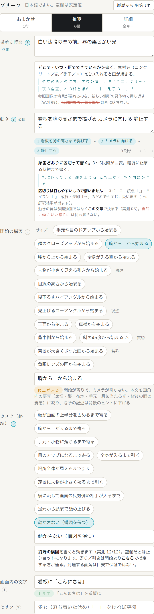
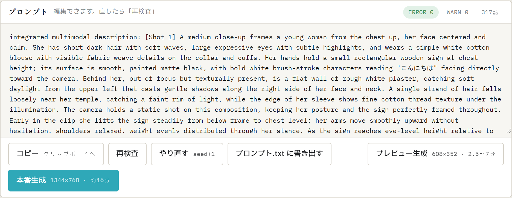

# 02. はじめての1本 — 起動から動画が出るまで

[01. 準備](01_準備.md) が済んでいる前提で、**参照画像なし・8秒のプレビュー動画を1本**作ります。題材は「白い壁の前で『こんにちは』の看板を掲げる人物」。参照素材や切り抜きを使わないので、初回でもここまでは一直線に通ります。

所要はプロンプト生成 20〜30秒＋動画生成 約2分半（この例の実測。動画生成は参照画像つきや長いプロンプトでは約7分まで延びます。いずれも RTX 4090 24GB での値）。

## 1. 作品を作る

上部バーの作品セレクタ横の **「＋」** を押し、作品名を入れて「作成」。名前はフォルダ名になります（例: `はじめての作品`）。

スタイル宣言・キャラ定義はまだ要りません。**新しい作品には既定のスタイル（手描き2Dアニメ調）が最初から入っています。** 自分の絵柄やキャラを使う設定は [05. 参照素材と切り抜き](05_参照素材と切り抜き.md) で。

## 2. ブリーフを書く

左ペインの「推奨」タブ（既定）で、次のように書きます。

| 欄 | 入力 |
|---|---|
| 場所と時間 | `白い漆喰の壁の前。昼の柔らかい光` |
| 動き | `看板を胸の高さまで掲げる カメラに向ける 静止する` |
| 開始の構図 | チップから「胸から上から始まる」 |
| カメラ（終端） | チップから「動かさない（構図を保つ）」 |
| 画面内の文字 | `看板に「こんにちは」` |
| セリフ | 空欄 |

入力すると3か所に小さな表示が出ます。ここで意図どおりかを確かめます:

- **動きの下** — 3段階に区切られたか（`看板を胸の高さまで掲げる → カメラに向ける → 静止する`）。区切りはスペースでも読点でも矢印でも構いません
- **開始の構図の下** — この組み合わせは「**修正が入る**」判定になります。胸から上の寄りで始まりカメラが動かないため、そのままでは場所の描写が勝って寄りが無視されるので、場所欄を背景のヒントに降格する修正が自動で入る、という意味です。正常な動作です（詳しくは [04. ブリーフの書き方](04_ブリーフの書き方.md#開始の構図)）
- **画面内の文字の下** — 「**出ます**」。ひらがな5文字は正確に描画される実測範囲です

下の設定はそのまま: **尺 8秒（→192f）・比率 16:9・seed は好きな数字**（この例では 42）。

## 3. プロンプトを生成する

**「プロンプトを生成」** を押します。ローカル LLM がブリーフから英語プロンプトを書き、機械検査に通らなければ最大3回まで自動修正します。20〜30秒ほどです（この例の実測）。

右ペインに結果が出たら、**送信前に読む場所は2つ**:

1. **プロンプトカードのバッジ** — `ERROR 0` になっているか。WARN は内容を読んで判断（そのまま進んでよいことが多い）
2. **本文** — 意図が入っているか。この例なら、看板の文字が `"こんにちは"` と**引用符つき**で本文にあること、動きが3段階の順序どおりに書かれていること

**ここが唯一の必須確認点です。** 直したいところがあれば本文を直接編集して「再検査」、書き直させたければ「やり直す（seed+1）」。

## 4. プレビュー生成

**「プレビュー生成」**（608×352）を押します。左下の進捗に、いま何が起きているかが流れます:

1. **GPU切替** — LM Studio のモデルを降ろして ComfyUI に GPU を渡します（このアプリの生成は GPU を LLM と取り合うため、毎回自動で切り替えます）
2. **ComfyUI** — 参照の読み込み → テキストエンコード → サンプリング `step 1〜6/6` → デコード。この例の実測で合計 約2分半

生成中にブラウザを閉じたり再読み込みしても大丈夫です。**ページを開き直すと実行中のジョブに自動で再接続します。** 中止したいときは進捗の「中止」（反応まで数十秒かかることがあります）。

## 5. 結果を確かめる

完了すると結果カードに、コンタクトシート 3×3・動画プレイヤー・計測値が出ます。

この例で見るところ:

- **コンタクトシート** — 画面の下から看板が持ち上がり、「こんにちは」が読める位置で止まる流れが9枚で追えます
- **看板の文字を自分の目で読む** — 「こんにちは」と一字ずつ。文字の正しさは機械では確認されません
- **計測値と注意書き** — この例では `192f / 実尺 8s` に加えて「⚠ 音量 mean -73.3 dB はほぼ無音」という注意書きが出ています。静かな場面なので想定内です — **注意書きは「正常域から外れた」の報告であって、不合格の判定ではありません**。数値の意味は [06. 生成と結果](06_生成と結果.md#4-結果カードの読み方)

> 上のスクリーンショットは、この章と同じブリーフで開発時に生成した実物のジョブを「過去のジョブ」から開いたものです（ヘッダーの作品名が違うのはそのためです）

気に入らなければ:

- **「seed+1 で再生成」** — 同じプロンプトで別の結果を引く（同じ seed のままだと ComfyUI はキャッシュを返すだけで再生成されません）
- **ブリーフに戻って直す** — 場所・動き・構図を変えて「プロンプトを生成」からやり直し

## 6. 本番生成と採用（ここから先は必要になったら）

- プレビューの構図で良ければ **「この設定で本番へ」** → 1344×768 で生成（実測 約16分）
- 納得した結果は **「この結果を採用」** → `プロンプト.txt`・アーカイブ・作品のショット履歴（S01）に記録されます

詳しくは [06. 生成と結果](06_生成と結果.md)。**自分のキャラを出したくなったら** [05. 参照素材と切り抜き](05_参照素材と切り抜き.md) に進んでください。
