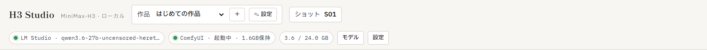
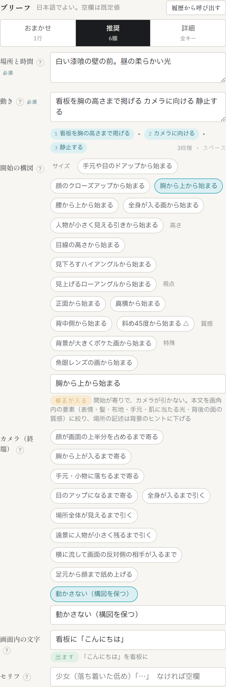
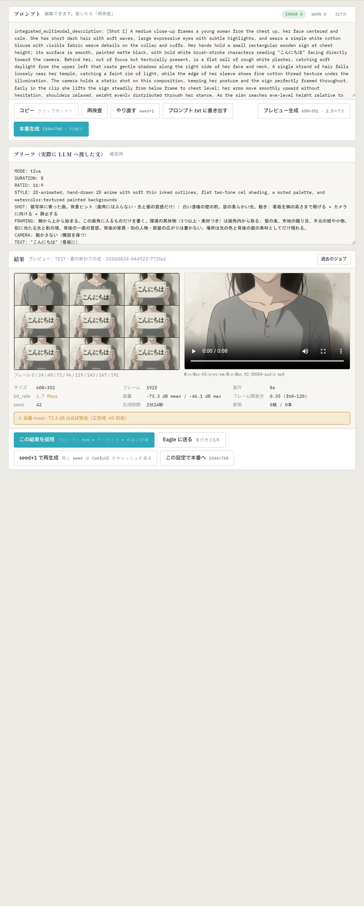

# 03. 画面の地図

1ページ・左右2ペインの画面です。**左で書き、右で読んで回します。** この章は場所の確認だけで、各部の使い方はリンク先の章にあります。

## 上部バー

| 場所 | 何か | 詳しくは |
|---|---|---|
| **作品** セレクタと「＋」 | 作品の切り替えと新規作成。スタイル宣言・キャラ定義・参照素材は作品ごとに保存される | [02](02_はじめての1本.md) |
| **ショット** | いま作っているショット番号（S01, S02, …）。「採用」のたびに進む | [06](06_生成と結果.md) |
| **LM Studio / ComfyUI / GB のピル** | 環境の生存表示と VRAM | [01 §5](01_準備.md#5-上部バーの見方起動確認) |
| **モデル** ボタン | LLM のモデル選択・ロード・クラウド切替 | [04](04_ブリーフの書き方.md#llm-のモデルを選ぶ) |
| **設定** ボタン | config の照合・ノード（N）・重み（W）・Eagle（E） | [01 §4](01_準備.md#4-設定画面で環境を確かめる) |

## 左ペイン（書く）

ブリーフの下に、参照素材・尺／比率／seed・「プロンプトを生成」ボタン・進捗が続きます。

| 場所 | 何か | 詳しくは |
|---|---|---|
| **ブリーフ** のタブ | おまかせ（A）／推奨（B・既定）／詳細（C） | [04](04_ブリーフの書き方.md) |
| モードB の6欄 | 場所と時間・動き・開始の構図・カメラ（終端）・画面内の文字・セリフ。各欄の `?` で書き方の説明が開く | [04](04_ブリーフの書き方.md) |
| **履歴から呼び出す** | 過去のブリーフ／プロンプトを左右に戻す | [06 §7](06_生成と結果.md#7-履歴と過去のジョブ) |
| **参照素材** | 作品に登録した画像・動画から今回使うものを選ぶ。**Windows エクスプローラーから直接ドラッグ＆ドロップも可**。「＋ 切り抜く」で切り抜き画面 | [05](05_参照素材と切り抜き.md) |
| **尺・比率・seed** | 4〜10秒・アスペクト比・乱数種（右の「ランダム」ボタンで具体的な乱数を入れられる）。尺の右にフレーム数（例 8秒 → 192f）が出る | [04](04_ブリーフの書き方.md#尺比率seed) |
| **プロンプトを生成** | ブリーフを LLM に渡してプロンプトを書かせる | [04](04_ブリーフの書き方.md) |
| **進捗** | LLM → 生成 → 検査 → GPU切替 → ComfyUI の5段とログ。生成中は「中止」もここ | [06 §3](06_生成と結果.md#3-進捗の読み方) |

## 右ペイン（読む・回す）

| 場所 | 何か | 詳しくは |
|---|---|---|
| **プロンプト** カード | 生成されたプロンプト（直接編集できる）と検査結果（ERROR/WARN）。コピー／再検査／やり直す／書き出す／プレビュー生成／本番生成 | [04](04_ブリーフの書き方.md#プロンプトを読む直す)・[06](06_生成と結果.md) |
| **ブリーフ（実際に LLM へ渡した文）** カード | 6欄がどう組み立てられて LLM に渡ったかの確認用。開始の構図で「修正が入る」判定のときはここで降格のされ方が見える | [04](04_ブリーフの書き方.md#開始の構図) |
| **結果** カード | コンタクトシート 3×3・動画・計測値・注意書き。採用／Eagle に送る／seed+1・ランダムで再生成／この設定で本番へ | [06 §4](06_生成と結果.md#4-結果カードの読み方) |

## モーダル（ボタンで開く画面）

| 画面 | 開き方 | 詳しくは |
|---|---|---|
| モデル | 上部「モデル」 | [04](04_ブリーフの書き方.md#llm-のモデルを選ぶ) |
| 設定 | 上部「設定」 | [01 §4](01_準備.md#4-設定画面で環境を確かめる) |
| 履歴から呼び出す | ブリーフ右上 | [06 §7](06_生成と結果.md#7-履歴と過去のジョブ) |
| 新しい作品 | 作品セレクタ横の「＋」 | [02](02_はじめての1本.md) |
| 切り抜き | 参照素材の「＋ 切り抜く」 | [05](05_参照素材と切り抜き.md) |
| 過去のジョブ | 結果カード右上 | [06 §7](06_生成と結果.md#7-履歴と過去のジョブ) |
| クラウド確認 | クラウド LLM 使用時、生成のたび | [04](04_ブリーフの書き方.md#llm-のモデルを選ぶ) |
