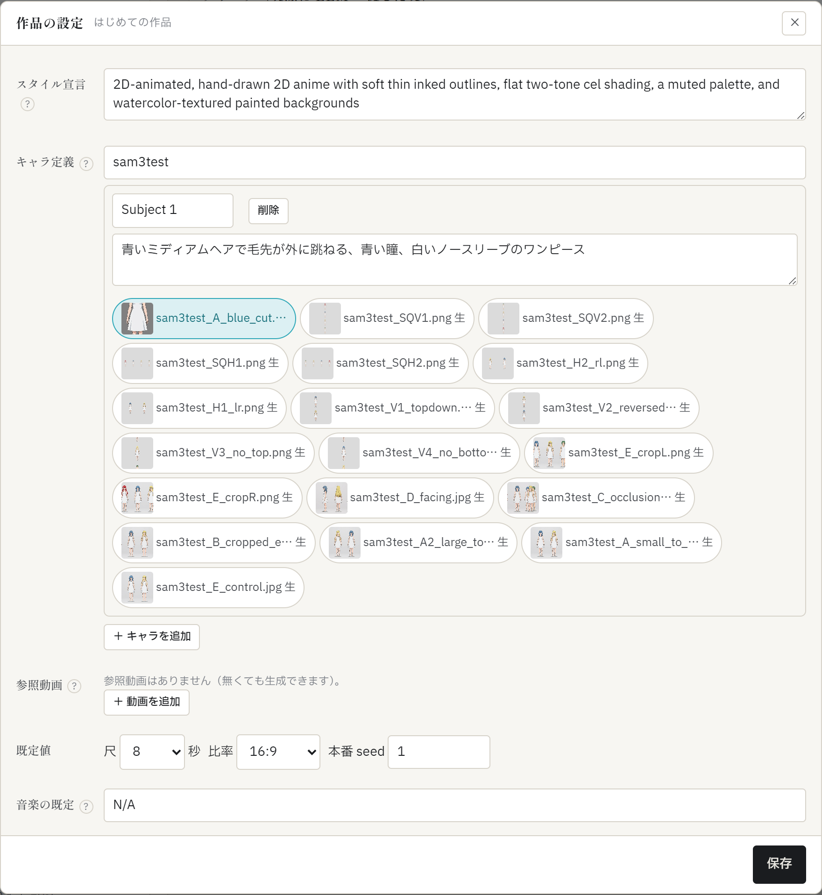
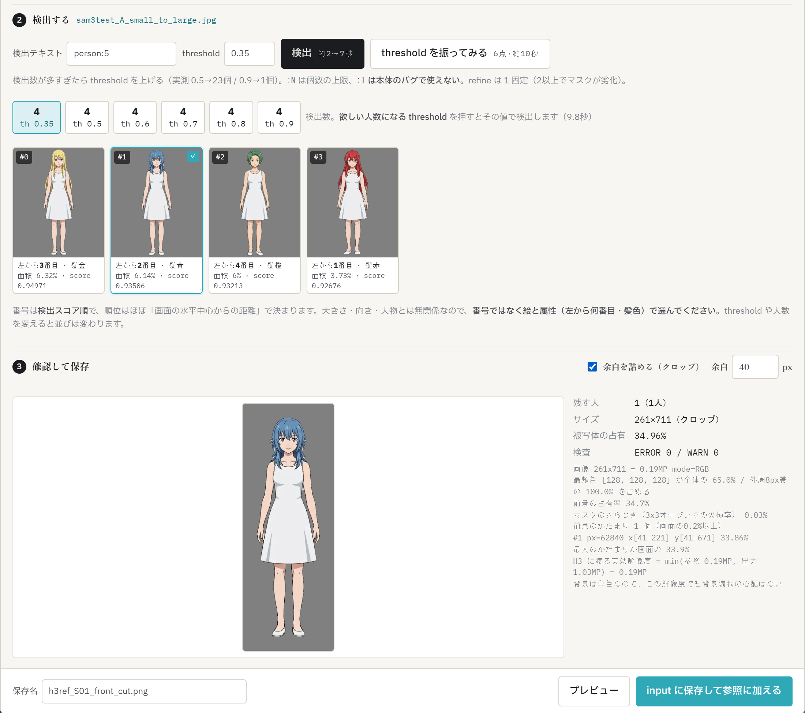

# 05. 参照素材と切り抜き — 自分のキャラを出す

参照素材は生成に渡す手がかりです。役割がはっきり分かれています:

- **参照画像（キャラ表）** — キャラの**見た目**を伝える。顔・髪・服の一貫性はここで決まる
- **参照動画** — モーション／カメラの参考。ただし**動きの質は「動き」欄の文章が支配的**です（実測）。動画を渡しても文章が曖昧なら曖昧に動きます

どちらも ComfyUI の `input` フォルダ（`config.comfy_input_dir`）にあるファイルを使います。

## 1. 作品に登録する — 「✎ 設定」

参照素材は作品ごとに登録します。上部バーの作品セレクタ横 **「✎ 設定」** で作品の設定を開きます。

| 項目 | 書くこと |
|---|---|
| **スタイル宣言** | プロンプトの STYLE にそのまま入る英語。**空欄なら既定（手描き2Dアニメ調）** |
| **キャラ定義** | 1人 = 1エントリ。「＋ キャラを追加」で増やす |
| **参照動画** | ファイルを選び、**動きの説明**（何がどう動くか）を日本語で書く |
| **既定値** | 尺・比率・本番 seed・音楽の既定 |

キャラ定義で大事なのは2つです:

- **説明** — 参照画像に写っている見た目を日本語で（髪・目・服。例: `焦げ茶のあごまでの髪に水色のメッシュ帯…白い半袖セーラー服`）。**この文がプロンプトの REFS 部にそのまま使われ、キャラの一貫性を支えます。** 空のままだと「キャラ表」とだけ渡り、見た目の情報が伝わりません
- **画像** — そのキャラの切り抜き済み画像（`_cut`）をサムネイル付きチップで紐づけます。**既定では切り抜き済みだけが表示されます**（`input` には画像が大量にあるため）。生画像を探すときは上の検索欄でファイル名を絞り込みます（選択済みのものは絞り込みに関係なく常に表示されます）

「保存」すると左ペインの参照素材に反映され、登録した画像・動画は既定で選択された状態になります。

## 2. 生成に使うものを選ぶ

左ペインの「参照素材」で、今回のショットに使うものをクリックで選びます。**選んだものは一覧からいなくなりません**（一覧自体は新しい順に絞られますが、選択済みは絞り込みの外に出ます）。

- 上限は**画像9枚・動画3本**
- **枚数が増えるほど安全に生成できる尺が短くなります**（実測。画像3枚以上または動画2本以上で9秒以上にするとフレーム数表示が警告色になります）。必要な素材だけに絞るのが安全です
- **生画像（「生」マーク・背景つき）はプレビュー専用と考えてください。** 608×352 のプレビューでは背景が漏れませんが、**本番 1344×768 では参照画像の背景が漏れます**(実測)。生画像を選んだまま本番生成しようとすると確認が出ます
- 参照動画を使うには ComfyUI 側に `VHS_LoadVideo`（ComfyUI-VideoHelperSuite）が必要です。無い環境では選んで生成しようとするとその旨が出て止まります
- **参照動画のチップには、静止しているときはその動画の先頭フレーム、ホバーすると実際の再生が出ます。** 先頭フレームは**Windows エクスプローラーが表示するのと同じ絵**です（実測で一致を確認済み）。エクスプローラーで探した見た目と同じものが画面にも出るので、ファイルを見分けるのに使えます。**ただしこれは「見分けるための絵」であって「実際に使われる範囲」ではありません**（次項）

### ⚠ 参照動画は全部が使われるわけではない

**実際に使われるのは動画の 2.0秒〜6.04秒だけです。** 読み込み時に先頭2.0秒を捨て、そこから約4.04秒ぶんだけを使います。

- **6秒より短い動画は後半が足りません**
- **2秒未満の動画はほとんど渡るものがありません**
- **一番見せたい動きを冒頭に置いた動画は、その部分が捨てられます。** 見せたい動きが2秒目以降に来るように動画を選ぶか編集してください
- チップのサムネイル（先頭フレーム）と、実際に使われる範囲（2秒目〜6.04秒）は**別物**です。サムネイルは見分けるための絵で、使用範囲を示してはいません

**動画は自動で 608×352 に縮小されてから使われます。** 大きい動画をそのまま置いても遅くなりません。むしろ縮小せずに使う方が大きく遅くなります（実測: 1280×720 のまま使うと総所要が+72.1%、711秒 → 1224秒）。手元の動画をそのままドロップして構いません。

### 素材をエクスプローラーから直接落とす

参照画像・参照動画は、**Windows エクスプローラーからそのまま枠にドラッグ＆ドロップできます。** あらかじめ `input` フォルダに置いておく必要はありません。中身ごと取り込まれます。

- 落としたものは**そのまま選択された状態**になります
- 対応形式は画像 `.png` `.jpg` `.jpeg` `.webp`、動画 `.mp4` `.webm` `.mov`。1ファイル 512MB まで
- 同名のファイルが既にある場合、**中身が同じなら既存をそのまま使い、違えば `名前_2.png` のように別名で保存します。上書きはしません**

一覧をスクロールして探すより、使い慣れたエクスプローラー（検索・並び替え・サムネイル）に任せる方が速いことが多いはずです。

## 3. 切り抜き — 「＋ 切り抜く」

元イラストから人物だけを単色背景（#808080）に抜いて、参照画像に使える形にします。参照素材の **「＋ 切り抜く」** で開きます（ComfyUI 側に `SAM3_Detect` が必要です）。

画面は上から 1 → 2 → 3 の順に進みます。

### 手順1: 元画像を選ぶ

`config.raw_dir` に置いた元イラストか、`input` の未切り抜き画像から選びます。**ここも Windows エクスプローラーから直接ドラッグ＆ドロップできます**（落とし先はいま選んでいるソースに従います。元イラストなら `raw_dir`、input なら `input`）。落とした画像はそのまま選択され、続けて「検出する」に進めます。

> **先に確認**: 元絵に伏せ字の検閲プレート（白い板など）が載っているなら、**切り抜きの前にインペイントで消してください**。SAM3 は板を人物の一部として拾うので、後から取り除けません。

### 手順2: 検出する

- 1人だけの絵なら、そのまま「検出」（約1〜7秒）
- **群像や検出数が合わないときは「threshold を振ってみる」**（6点・約10〜17秒）。threshold ごとの検出人数が出るので、**欲しい人数になった値のチップを押す**とその値で検出します。目安の実測例: 0.35→34人 / 0.5→23 / 0.7→9 / 0.9→1（中央の1人だけ）。**絵ごとに変わるので、新しい絵では毎回振るのが早道です**（上のスクリーンショットのような整ったキャラ表なら、どの threshold でも同じ人数になることもあります。敏感なのは人物が重なり合う群像です）
- 検出テキストは既定 `person:5` のままでよい。`:N` は**個数の上限**です（**`:1` は ComfyUI 本体のバグで使えず、アプリが弾きます**）。refine は 1 固定です（2以上でマスクが劣化する実測のため、画面からは変えられません）

検出結果は人物ごとのサムネイルで並び、**左から何番目・髪色・面積・score** が付きます。

> **番号（#N）は使い捨てです。** 並び順は検出スコア順で、ほぼ「画面の水平中心からの距離」で決まります。大きさとも人物とも無関係で、threshold や人数を変えると入れ替わります。**「#3 の人」ではなく、絵と属性（左から2番目・金髪）で選んでください。**

### 手順3: 確認して保存

残す人物のサムネイルをクリックすると（複数可）、すぐにプレビューと検査が出ます。

| 検査項目 | 見方 |
|---|---|
| 背景の単色性 | 抜き残しがないか |
| かたまりの数 | 1人なら1が理想。ただし**髪や小物が繋がっていると1人でも3個などと出ます**。警告が出ても、プレビューを見て問題なければ進んでよい（最後は目で判断） |
| 被写体の占有率 | 画像のうち人物が占める割合。**群像の端の小さい人物は数%しかないことがある** → **「余白を詰める」にチェック**すると人物の周りでクロップされ、実測で 2% → 31.5% まで上がった例があります |
| 実効解像度 | 切り抜き後の人物の実サイズ |

保存名を確認して **「input に保存して参照に加える」**。保存された画像は参照素材に自動で追加・選択されます。あとは上の「作品の設定」（✎ 設定）でキャラ定義に紐づけ、説明を書けば完成です。

### 切り抜きでうまくいかないとき

| 症状 | 対処 |
|---|---|
| 「threshold を下げてください」と出る | threshold が高すぎて検出ゼロ。スイープで人数の出る値を探す |
| 欲しい人物が検出に出てこない | threshold を下げる。それでも拾えない絵は現状の画面（テキスト検出のみ）では対応できないことがあります |
| 髪の先や小物が欠ける | threshold を下げて拾い直す。refine を上げる対処は**できません**（劣化するため封じてあります） |
| 群像で人物が小さすぎる | 「余白を詰める」にチェック |
