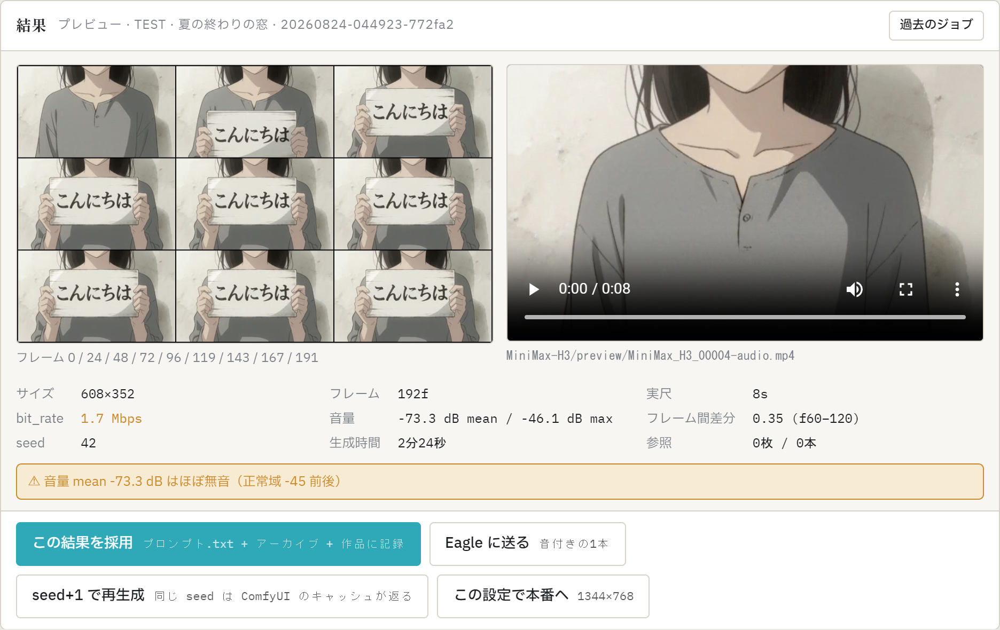

# 06. 生成と結果 — プレビューから採用まで

プロンプトが `ERROR 0` になったら生成に進みます。この章は「押したあとに画面で何が起き、何を読み、どう次につなげるか」です。

> 所要時間はすべて RTX 4090 24GB での実測です。環境で変わります。

## 1. プレビューと本番

| | プレビュー | 本番 |
|---|---|---|
| 解像度 | 608×352 | 1344×768 |
| 所要（実測） | 下記参照 | **約16分**（2026-08-23 の実測 15.6分。このときの GPU 電力設定は記録が無く、条件が違う可能性がある） |
| 用途 | 構図・動き・文字の確認。**背景つきの生画像でも背景が漏れない** | 納品用。生画像は背景が漏れる |

**プレビューで構図を確定 → 「この設定で本番へ」** が基本の流れです。同じ seed・同じプロンプトで本番に投入します（解像度が変わるため、画は完全に同一にはなりません）。

### プレビュー生成の所要時間について

**このアプリは生成のたびに毎回モデルを読み込み直します。** 「連続で回すと2本目以降は速くなる」という挙動はありません（読み込んだままにする設定が特定条件で自動選択されることが以前はありましたが、VRAMが詰まる既知の問題があったため2026-08-26に廃止しました）。

実測（RTX 4090・電力リミット 360W・プレビュー 608×352・参照素材なし・同一プロンプト・2026-08-25・15本）では、**2分〜2分20秒台**が多いものの、**まれに5分以上**（336秒の例あり）でした。

**平均や典型値はここには書きません。どの回も代表していないからです。** 遅くなるときはモデルの読み込み（進捗の step 1 の前）だけが伸びます。同じ空きVRAMからでも6.3〜10.3秒で終わる回と213〜494秒かかる回があり、**何が両者を分けるのかは分かっていません。** 遅くても壊れているわけではないので、そのまま待ってください。

**ごくまれに、完了も中止もできなくなることがあります。** そのときだけ ComfyUI を再起動してください（[07. 困ったとき](07_困ったとき.md#生成が数分〜10分近く固まる)）。

## 2. 生成の前にアプリが自動でやること

このアプリは LLM（LM Studio）と ComfyUI が **1枚の GPU を取り合う**前提で作られています。ボタンを押すと:

1. LM Studio のモデルを降ろして ComfyUI に GPU を渡す（プレビュー／本番生成時)
2. 逆にプロンプト生成に戻るときは、必要なら先に ComfyUI の VRAM を空けてから LLM を載せ直し、**GPU に載りきったかを確かめ**ます（順番を誤ると LLM が数倍遅くなるため。アプリ任せでよく、あなたの操作は不要です）
3. **ComfyUI のキューに他のジョブがあるときは投入しません**（「ComfyUI のキューに他のジョブがあります」と出たら、他のセッションや手動ワークフローの生成が終わるのを待つ）

## 3. 進捗の読み方

左下の進捗が5段で流れます: **LLM → 生成 → 検査 → GPU切替 → ComfyUI**（前3つはプロンプト生成、後2つが動画生成）。

- ComfyUI 段では `step 1〜6/6` のサンプリング進行が出ます。step が始まるまでの待ち（テキストエンコードと UNET 読み込み）が最も長く、**プロンプトが長いほど延びます**
- **ページを閉じても生成は止まりません。** 開き直すと実行中ジョブに自動で再接続します
- **中止**は進捗の「中止」ボタン。**押してから止まるまで数十秒〜数分かかることがあります**（VRAM が逼迫していると ComfyUI の応答自体が遅くなるため・実測）。連打せず待ってください
- サーバー（server.py）を生成中に再起動すると進捗の追跡が切れます。ComfyUI 側の生成は走り続けますが、結果はアプリに記録されません

## 4. 結果カードの読み方

完了すると結果カードにコンタクトシート・動画・計測値・注意書きが出ます。

- **コンタクトシート 3×3** — 最初から最終フレームまでを等間隔に9枚。動きの全体と構図の変化をひと目で確認できます。キャラの顔・服が参照どおりかはここで見るのが速い
- **動画** — 音声つき。**画面内の文字を指定した場合は、ここで一字ずつ自分の目で読むこと**（稀少字は「別の実在漢字」に置き換わるため機械では見つけられません）

計測値の意味と目安:

| 項目 | 意味 | 目安（実測に基づく） |
|---|---|---|
| フレーム数 / 実尺 | 生成されたフレーム数と秒数 | 指定と違えば注意書きが出る |
| bit_rate | 動画のビットレート | 本番 1344×768 で 11〜14 Mbps が正常域。プレビュー 608×352 なら 2.3 Mbps 前後。**大きく低いと破損・ベタ塗り化の疑い**（注意書きが出る） |
| 音量 mean | 音声の平均音量 | -45 dB 前後が正常域。-70 dB を下回るとほぼ無音として注意書きが出る |
| フレーム間差分 | 隣接フレームの平均絶対差。動き・ちらつきの目安 | 参考値。並べて比べる用（正常値というものはありません） |

**注意書き（⚠）は「正常域から外れた」の報告であって、不合格の判定ではありません。** 採用するかはあなたが動画を見て決めます。

## 5. 次の一手 — 結果カードのボタン

| ボタン | 何が起きるか |
|---|---|
| **この結果を採用** | `プロンプト.txt` を上書きし、アーカイブ（.txt）を書き、作品のショット履歴に動画パス・計測値・job id を記録。ショット番号が進む（S01 → S02） |
| **seed+1 で再生成** | seed を1進めて同じプロンプトを再投入。**隣を見る用**——構図はそのままで細部だけ変えたいときに |
| **ランダムで再生成** | 0〜2⁵³-1のランダムな seed で同じプロンプトを再投入。**大きく振る用**——まったく違う結果を試したいときに。ComfyUI に「-1」を渡すのではなくアプリが具体的な数字を選ぶので、**使った seed は結果カードとジョブ記録に残ります** |
| **この設定で本番へ** | 同じ seed・同じプロンプトで 1344×768 に投入 |
| **Eagle に送る** | 下記 |

## 6. Eagle に送る

[Eagle](https://eagle.cool/) を使っている場合、出来上がった動画を登録できます。「設定」→ E の欄で有効化し、送信先フォルダと自動送信（しない／本番だけ／全部）を選びます。

- 送られるのは**音声つきの1本だけ**（コンタクトシートも送る設定にできます）
- 注釈にプロンプト本文・ブリーフ・計測値・生成時間・job id が入り、作品名・ショットID・本番/プレビューなどのタグが付きます
- 同じファイルを再送しても Eagle 側で同定され、重複しません
- 自動送信が失敗しても生成は成功のままです（進捗ログに警告が出るだけ)

## 7. 履歴と過去のジョブ

- **履歴から呼び出す**（ブリーフ右上） — 書き出し済みのブリーフ／プロンプトを検索し、左右のペインに戻せます。別作品のものも「この作品だけ」を外せば探せます
- **過去のジョブ**（結果カード右上） — このアプリから投入した生成の一覧。クリックで結果カードを開き直せます。開き直してから「Eagle に送る」もできます
